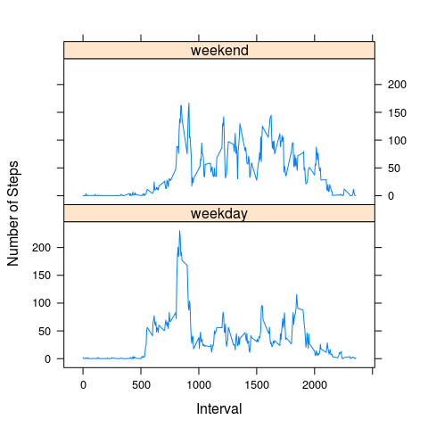

# Reproducible Research: Peer Assessment 1

## Loading and preprocessing the data

Load the data using read.csv().


```r
data=read.csv('./activity.csv')
```

## What is mean total number of steps taken per day?

1. Calculate and make a histogram of the total number of steps per day.


```r
totals=aggregate(steps~date,data,sum)
hist(totals$steps,xlab='Steps/Day',
     main = 'Total Steps Per Day')
```

 

2. Calculate the mean and median total number of steps taken per day.


```r
totals.steps.mean=mean(totals$steps)
totals.steps.median=median(totals$steps)
```

The mean total number of steps taken per day is 1.0766 &times; 10<sup>4</sup>. The median total number of steps taken per day is 10765. 

## What is the average daily activity pattern?

1. Make a time series plot of the 5-minute interval (x-axis) and the average number of steps taken, averaged across all days (y-axis).


```r
avgs=aggregate(steps~interval,data,mean)
plot(avgs$interval,avgs$steps,type='l',
     xlab='Interval',ylab='#Steps',
     main='Average Steps Per Interval')
```

 

2. Find out which 5-minute interval, on average across all the days in the dataset, contains the maximum number of steps.


```r
idx = which(avgs$steps==max(avgs$steps))
imax = avgs$interval[idx]
```

The 5-minute interval #835, on average across all the days in the dataset, contains the maximum number of steps.

## Imputing missing values with mean for that interval

1. Calculate the total number of missing values in the dataset.


```r
total.nas = sum(is.na(data$steps))
```

The total number of missing values in the dataset is 2304.

2. Filling in all of the missing values in the dataset using the mean for that 5-minute interval. Create a new dataset "data2" that is equal to the original dataset but with the missing data filled in.


```r
data2=merge(data,avgs,by='interval',suffixes=c('','.mean'))
data2=data2[order(data2$date),]
rownames(data2)=NULL

idx = is.na(data2$steps)
data2$steps[idx]=data2$steps.mean[idx]
```

3. With "data2", make a histogram of the total number of steps taken each day and calculate and report the mean and median total number of steps taken per day.


```r
totals2=aggregate(steps~date,data2,sum)
hist(totals2$steps,xlab='Steps/Day',
     main = 'Total Steps Per Day')
```

 

```r
totals2.steps.mean=mean(totals2$steps)
totals2.steps.median=median(totals2$steps)
```

After imputing missing values, the mean total number of steps taken per day is 1.0766 &times; 10<sup>4</sup>. The median total number of steps taken per day is 1.0766 &times; 10<sup>4</sup>.

Comparing to the values before imputing missing values, mean remains the same while median slightly increased, to the same value of mean.

So the impact of imputing missing data on the estimates of the total daily number of steps is likely to change median to the same value of mean.

## Are there differences in activity patterns between weekdays and weekends?

1. Use the dataset with the filled-in missing values (data2) and create a new factor variable (whatday) in the dataset with two levels – “weekday” and “weekend” indicating whether a given date is a weekday or weekend day.


```r
data2$date=as.Date(data2$date,format = "%Y-%m-%d")
library(timeDate)
data2$whatday=ifelse(isWeekday(data2$date),'weekday','weekend')
data2$whatday=as.factor(data2$whatday)
```

2. Make a panel plot containing a time series plot of the 5-minute interval (x-axis) and the average number of steps taken, averaged across all weekday days or weekend days (y-axis). 


```r
avgs2=aggregate(steps~interval+whatday,data2,mean)
library(lattice)
xyplot(steps~interval|whatday,avgs2,type='l',layout=c(1,2),
       xlab='Interval',ylab='Number of Steps')
```

 

From the plot, there are indeed differences in activity patterns between weekdays and weekends.
